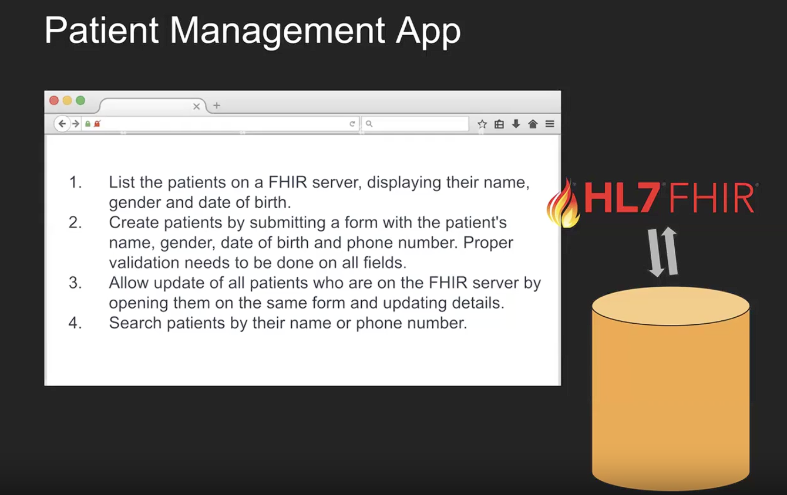

# HealthPlus Patient Management Application

A browser-based patient management portal built with vanilla HTML, CSS, and JavaScript against the **HAPI FHIR R4** public server. Full CRUD operations on Patient resources with search, pagination, bulk operations, visit history, and appointment calendar.



## Demo

[](patient_management_app.html)

> Open with a local HTTP server for best results: `python3 -m http.server 8080`

## Features

- **Patient CRUD** - Create, read, update, and delete patient records via FHIR REST API
- **Search** - Find patients by name (prefix match) or phone number (exact match) with auto-detection
- **Pagination** - Configurable page sizes (10, 50, 100) with page navigation and accurate totals
- **Bulk Operations** - Checkbox selection for batch update or delete with confirmation modal
- **Visit History** - Read-only table of past Encounters for each patient
- **Appointment Calendar** - Visual month calendar highlighting previous visit dates
- **Form Validation** - Client-side validation for all fields (name, DOB, phone, ZIP)
- **Error Recovery** - Pagination error handling, cascade delete for referential integrity (409 Conflict)
- **Responsive Design** - Adapts to desktop, tablet, and mobile viewports
- **Zero Dependencies** - Single HTML file, no frameworks, no build tools

## Quick Start

### Option 1: Local HTTP Server (Recommended)

```bash
cd 1_Patient_Management_Application
./scripts/serve.sh
# Opens http://localhost:8080 in your browser
```

Or manually:
```bash
python3 -m http.server 8080
```

### Option 2: Open Directly

Open `patient_management_app.html` in your browser. Note: some FHIR API calls may fail due to CORS restrictions from `file://` protocol. Using a local server avoids this.

## FHIR API Endpoints

| Operation | HTTP Method | Endpoint | Description |
|-----------|------------|----------|-------------|
| List/Search | `GET` | `/Patient?_count=50&_offset=0&_sort=-_lastUpdated&_total=accurate` | Paginated patient list |
| Search by Name | `GET` | `/Patient?name={term}` | Prefix match on patient name |
| Search by Phone | `GET` | `/Patient?phone={number}` | Exact match on phone number |
| Read | `GET` | `/Patient/{id}` | Fetch single patient |
| Create | `POST` | `/Patient` | Create new patient (JSON body) |
| Update | `PUT` | `/Patient/{id}` | Update patient (full resource) |
| Delete | `DELETE` | `/Patient/{id}` | Delete patient (cascade on 409) |
| Encounter | `GET` | `/Encounter?subject=Patient/{id}&_sort=-date&_count=1` | Most recent visit |
| Appointment | `GET` | `/Appointment?patient=Patient/{id}&status=proposed,booked&_sort=date&_count=1` | Next appointment |
| Server Stats | `GET` | `/Patient?_summary=count` | Total patient count |

**Base URL**: `https://hapi.fhir.org/baseR4`

## Tech Stack

| Technology | Purpose |
|-----------|---------|
| HTML5 | Semantic markup, forms, tables |
| CSS3 | Custom properties (Verdigris theme), responsive grid, animations |
| JavaScript ES6+ | `fetch()` API, async/await, template literals, `Set` for selection |
| FHIR R4 | HL7 healthcare interoperability standard |
| HAPI FHIR | Public test server (no authentication required) |

## Architecture

Single-file SPA with three views toggled via CSS `display`, centralized `STATE` object, and a `fhirFetch()` wrapper for all REST communication.

```
Browser (patient_management_app.html)   HAPI FHIR R4 Server
┌─────────────────────┐       ┌──────────────────────┐
│  UI Layer (3 views)  │       │  REST API             │
│  STATE Object        │──────>│  Patient / Encounter  │
│  fhirFetch() Client  │<──────│  Appointment          │
└─────────────────────┘       └──────────────────────┘
   HTTP GET/POST/PUT/DELETE      JSON Bundle/Resource
```

See [docs/architecture.md](docs/architecture.md) for detailed diagrams and code walkthrough.

## Folder Structure

```
1_Patient_Management_Application/
├── patient_management_app.html  # The complete application (single file)
├── README.md               # This file
├── assets/
│   └── screenshot.png      # Application screenshot
├── docs/
│   ├── requirements.md     # Project requirements specification
│   ├── architecture.md     # Architecture documentation with diagrams
│   └── blog-post/          # Full documentation blog post (3 formats)
└── scripts/
    └── serve.sh            # Local development server launcher
```

## Known Limitations

- **Public server data**: HAPI FHIR public server is shared globally. Patient data may be modified or deleted by other users at any time.
- **CORS from file://**: Opening `patient_management_app.html` directly may cause intermittent CORS failures. Use a local HTTP server for reliable operation.
- **No authentication**: The public test server requires no auth. Production FHIR servers require SMART on FHIR OAuth2 (covered in Apps 2-4).
- **Visit history is read-only**: The app reads Encounters but does not create them (out of scope for this project).

## Documentation

- [Requirements Specification](docs/requirements.md)
- [Architecture Documentation](docs/architecture.md)
- [Full Blog Post (Mermaid diagrams)](docs/blog-post/healthplus-patient-management-fhir-app.md)

## License

MIT - see [LICENSE](../LICENSE)
