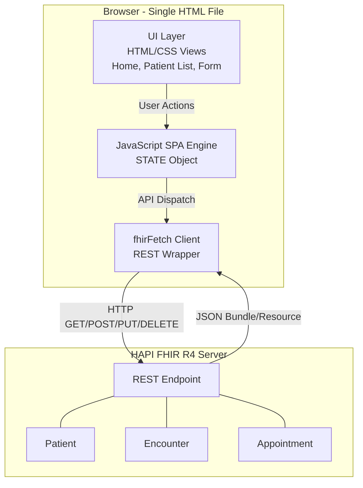
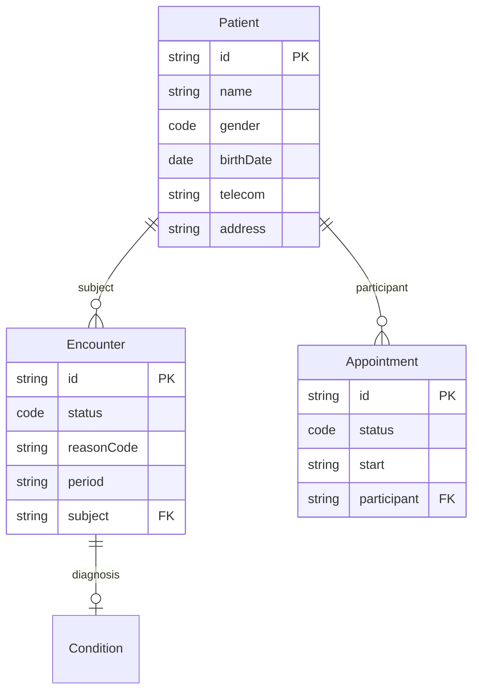
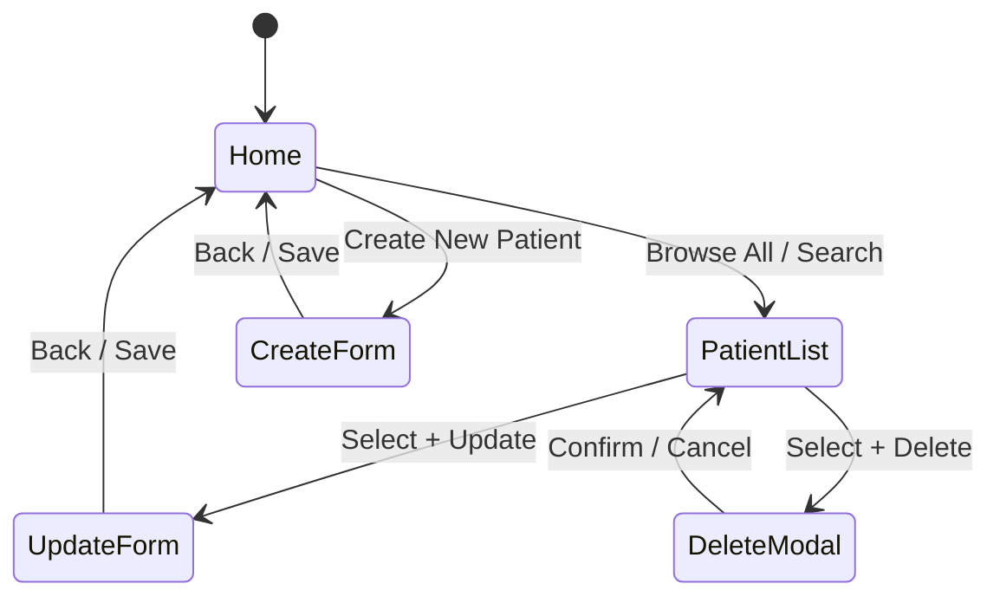

# HealthPlus Patient Management Application - Architecture

## Overview

The application is a **single-file SPA** (1,658 lines) where the browser communicates directly with the HAPI FHIR R4 server via REST. There is no backend, no database, and no middleware.

## High-Level Architecture



## FHIR Resource Relationships



## CRUD Operations

| Operation | Method | Endpoint | Notes |
|-----------|--------|----------|-------|
| **Create** | `POST` | `/Patient` | `buildPatientResource()` converts form to FHIR JSON |
| **Read** | `GET` | `/Patient?_count=50&_offset=0&_sort=-_lastUpdated&_total=accurate` | Returns Bundle with pagination |
| **Update** | `PUT` | `/Patient/{id}` | Full resource replacement |
| **Delete** | `DELETE` | `/Patient/{id}` | Falls back to `?_cascade=delete` on 409 Conflict |
| **Search (name)** | `GET` | `/Patient?name={term}` | Prefix match, auto-detected |
| **Search (phone)** | `GET` | `/Patient?phone={number}` | Exact token match, auto-detected when 7+ digits |

## Core Components

### fhirFetch() - REST Client Wrapper

All FHIR communication flows through a single function that handles headers, error parsing (OperationOutcome), and HTTP status propagation:

```javascript
async function fhirFetch(path, options = {}) {
  const url = path.startsWith('http') ? path : `${FHIR_BASE}/${path}`;
  const resp = await fetch(url, {
    ...options,
    headers: { ...FHIR_HEADERS, ...options.headers }
  });
  if (resp.status === 204) return null;
  if (!resp.ok) {
    const body = await resp.json().catch(() => null);
    const diag = body?.issue?.[0]?.diagnostics || '';
    throw new Error(`HTTP ${resp.status}${diag ? ': ' + diag : ''}`);
  }
  return resp.json();
}
```

### STATE - Centralized State Management

```javascript
const STATE = {
  currentView: 'home',
  patients: [],
  totalPatients: 0,
  pageSize: 50,
  currentPage: 1,
  totalPages: 0,
  searchTerm: '',
  searchType: 'name',
  selectedIds: new Set(),
  encounterCache: {},
  appointmentCache: {},
  formMode: null,
  editingPatientId: null,
  editingPatient: null,
  isLoading: false,
};
```

### Lazy Loading with Throttling

Each patient row needs 2 additional API calls (Encounter + Appointment). The app uses a **6-worker pool** to avoid overwhelming the server, with in-memory caching:

```javascript
async function batchLoadExtras(patients) {
  const queue = [...patients];
  const concurrency = 6;
  const workers = Array(concurrency).fill(null).map(async () => {
    while (queue.length > 0) {
      const p = queue.shift();
      await Promise.allSettled([loadEncounter(p.id), loadAppointment(p.id)]);
    }
  });
  await Promise.allSettled(workers);
}
```

### Cascade Delete

FHIR servers enforce referential integrity. Patients with linked resources return 409 Conflict on delete:

```javascript
async function deletePatientById(id) {
  try {
    return await fhirFetch(`Patient/${id}`, { method: 'DELETE' });
  } catch (err) {
    if (err.message.includes('409') || err.message.toLowerCase().includes('conflict')) {
      return fhirFetch(`Patient/${id}?_cascade=delete`, { method: 'DELETE' });
    }
    throw err;
  }
}
```

## View Architecture



## Design System

| Token | Value | Usage |
|-------|-------|-------|
| `--primary` | `#43B3AE` (Verdigris) | Buttons, links, accents |
| `--primary-dark` | `#359490` | Hover states |
| `--primary-bg` | `#E8F5F4` | Table headers, card backgrounds |
| Salmon Pink | `#FA8072` | Logo accent, button flash, calendar highlights |
| Error | `#C62828` | Delete button (active), validation errors |

## Error Handling Patterns

| Scenario | Response | App Behavior |
|----------|----------|-------------|
| FHIR search fails | Network error | Preserves pagination, shows retry button, reverts page counter |
| Delete blocked | HTTP 409 Conflict | Automatically retries with `?_cascade=delete` |
| Invalid form data | Client-side | Progressive validation on blur, full check on submit |
| Server down | Fetch throws | Toast notification with error message |
