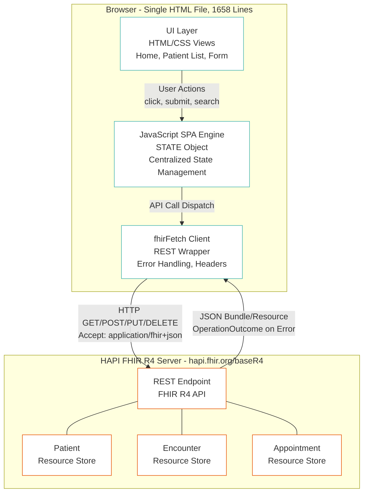
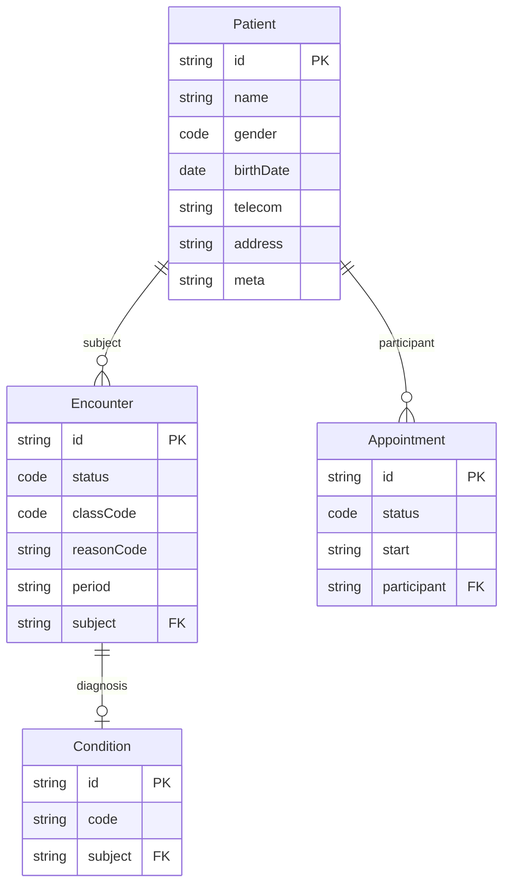
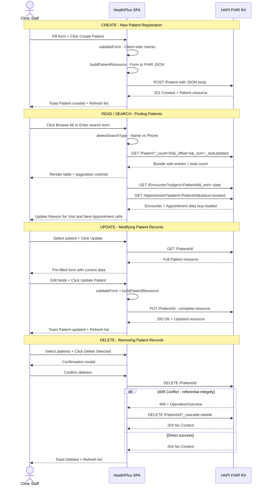
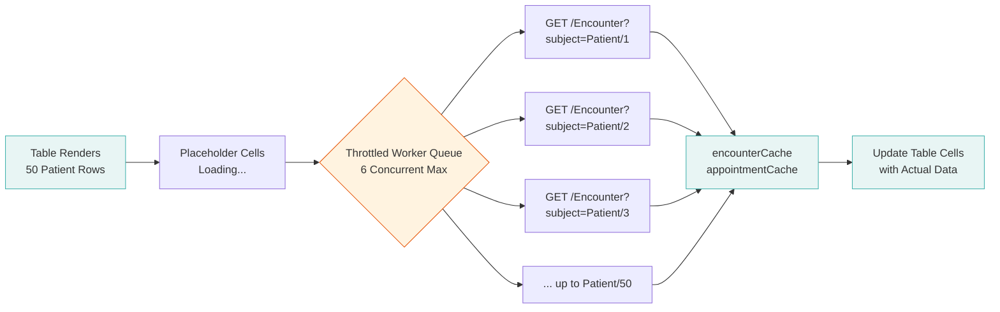
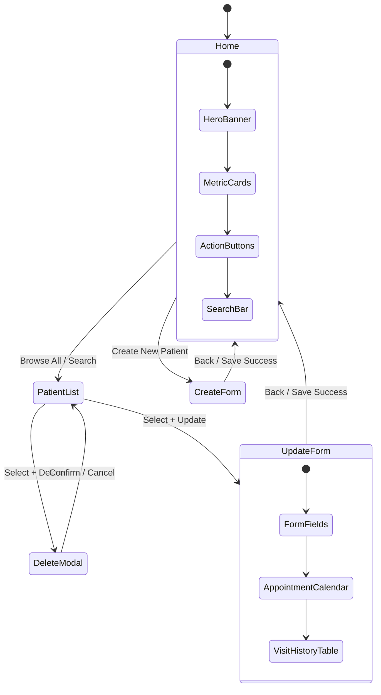
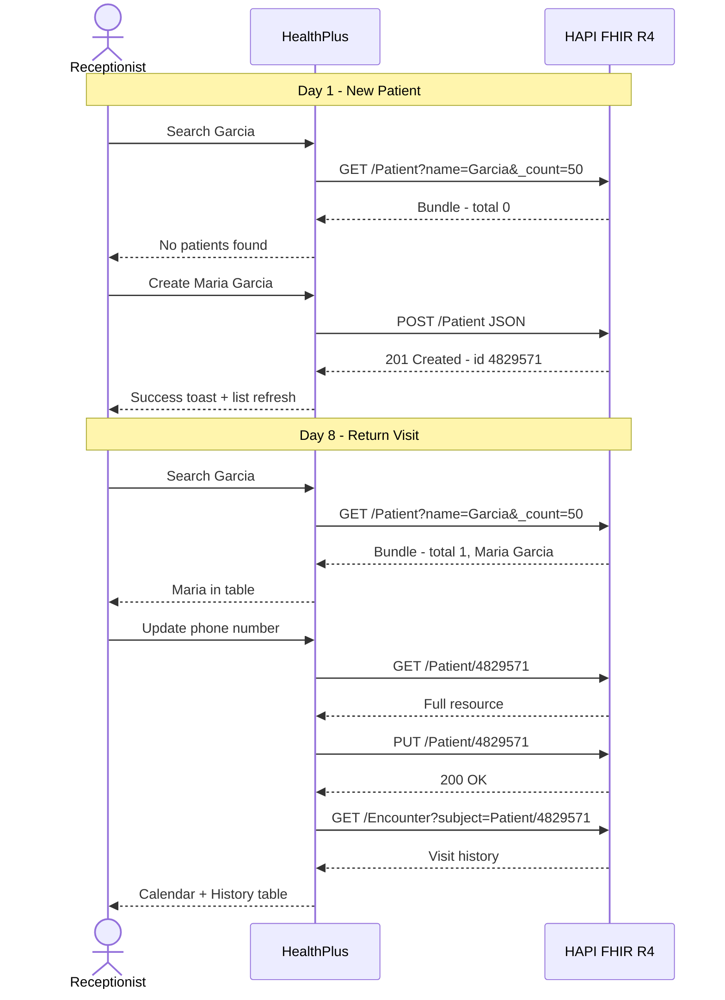

# HealthPlus Patient Management Application: Building a FHIR-Powered Clinical Portal

> *"The best way to understand FHIR is to build something real with it. Not a toy example, not a specification walkthrough -- a working clinical tool that creates, reads, updates, and deletes patient data on a live server."*

---

## 1. Introduction

Picture walking into a small clinic called **HealthPlus**. The front desk staff needs to look up a patient, register a new walk-in, update a phone number, and check visit history -- all in under two minutes. Behind the scenes, every one of those actions is a RESTful API call to a FHIR server, translating clinical workflows into standardized, interoperable data exchange.

The **HealthPlus Patient Management Application** is a browser-based clinical portal built entirely with vanilla HTML, CSS, and JavaScript -- no frameworks, no build tools, no dependencies. It connects directly to a **HAPI FHIR R4** server using the HL7 FHIR RESTful API protocol, performing full CRUD (Create, Read, Update, Delete) operations on Patient resources and fetching related Encounter and Appointment data.

This documentation walks through how and why the application was built, the architecture decisions that shaped it, and the lessons learned from connecting a browser-based frontend to a live FHIR server.


*The four core requirements that drove the application design.*

### What This Application Demonstrates

- **FHIR R4 REST API fluency**: Every interaction maps to a standard FHIR operation
- **Zero-dependency web development**: Proof that clinical tools don't require heavy frameworks
- **Real-world error handling**: CORS issues, referential integrity conflicts, pagination edge cases
- **Clinical workflow alignment**: The UI mirrors how clinic staff actually work with patient data

---

## 2. Requirements

### Core Mandatory Requirements

The application was built to satisfy four fundamental requirements for a clinic-facing patient management system:

| # | Requirement | FHIR Operation | Status |
|---|-------------|----------------|--------|
| 1 | List patients displaying name, gender, and date of birth | `GET /Patient` with search parameters | Implemented |
| 2 | Create patients via validated form (name, gender, DOB, phone) | `POST /Patient` with JSON body | Implemented |
| 3 | Update existing patients using the same form | `GET /Patient/{id}` then `PUT /Patient/{id}` | Implemented |
| 4 | Search patients by name or phone number | `GET /Patient?name=` or `GET /Patient?phone=` | Implemented |

### Extended Requirements

Beyond the core four, the application implements several additional features needed for a production-ready clinical tool:

| Feature | Description |
|---------|-------------|
| **Pagination** | Configurable page sizes (10, 50, 100) with page navigation controls |
| **Bulk Operations** | Checkbox selection for batch update or delete with confirmation modal |
| **Visit History** | Read-only table of past Encounters for each patient |
| **Appointment Calendar** | Visual calendar highlighting previous visit dates |
| **Reason for Visit** | Most recent Encounter reason displayed in patient table |
| **Next Appointment** | Upcoming Appointment date/time or "No Appointment" indicator |
| **Form Validation** | Client-side validation for all fields (name, DOB, phone, ZIP) |
| **Error Recovery** | Pagination error handling, cascade delete for referential integrity |
| **Responsive Design** | Adapts to desktop, tablet, and mobile viewports |

---

## 3. Tools Used

### HAPI FHIR Server

**HAPI FHIR** (Health API for FHIR) is the most widely used open-source FHIR server implementation, built in Java by Smile CDR.

| Property | Detail |
|----------|--------|
| **Public Endpoint** | `http://hapi.fhir.org/baseR4` |
| **FHIR Version** | R4 (4.0.1) |
| **Authentication** | None required (public test server) |
| **Data Availability** | Pre-populated with thousands of synthetic Patient, Encounter, Observation, and Appointment resources |
| **Source Code** | [github.com/hapifhir/hapi-fhir](https://github.com/hapifhir/hapi-fhir) |
| **License** | Apache 2.0 |

The HAPI FHIR public server is an invaluable resource for learning and prototyping. It accepts all standard FHIR REST operations without authentication, making it ideal for building and testing client applications. The server exposes a **CapabilityStatement** at `/metadata` that describes every resource type and search parameter it supports.

> **Note**: The public server is shared by developers worldwide. Data may be modified or deleted by other users at any time. For production use, you would deploy a private HAPI FHIR instance or use a commercial FHIR server.

### FHIR R4 Specification

The **HL7 FHIR (Fast Healthcare Interoperability Resources)** standard defines how healthcare data is structured, stored, and exchanged. FHIR R4 (Release 4) is the current normative version, widely adopted by EHR vendors (Epic, Cerner, Allscripts), government mandates (ONC, CMS), and health information exchanges.

Key FHIR concepts used in this application:

- **Resources**: The atomic units of FHIR data (Patient, Encounter, Appointment)
- **References**: How resources link to each other (`Encounter.subject` references `Patient/{id}`)
- **Bundles**: Search result containers holding multiple resources with pagination links
- **OperationOutcome**: Error response format with diagnostic messages

### RESTful API

The application communicates with the FHIR server exclusively through HTTP REST calls:

| HTTP Method | FHIR Operation | Example |
|-------------|----------------|---------|
| `GET` | Read / Search | `GET /Patient/123` or `GET /Patient?name=Garcia` |
| `POST` | Create | `POST /Patient` with JSON body |
| `PUT` | Update | `PUT /Patient/123` with full resource JSON |
| `DELETE` | Delete | `DELETE /Patient/123` |

All requests use the header `Accept: application/fhir+json` and `Content-Type: application/fhir+json` to indicate FHIR JSON format.

### Postman

**Postman** was used during development to:
- Test FHIR endpoints before writing JavaScript code
- Inspect response structures (Bundle, Patient, OperationOutcome)
- Validate search parameter behavior (`_count`, `_offset`, `_sort`, `_total`)
- Debug CORS issues by comparing browser vs. Postman responses
- Build a collection of FHIR API calls for reference

Example Postman queries used during development:
```
GET http://hapi.fhir.org/baseR4/Patient?_count=10&_sort=-_lastUpdated&_total=accurate
GET http://hapi.fhir.org/baseR4/Patient?name=Smith
GET http://hapi.fhir.org/baseR4/Encounter?subject=Patient/123&_sort=-date&_count=1
GET http://hapi.fhir.org/baseR4/metadata
```

### Programming Tools and Languages

| Tool | Purpose |
|------|---------|
| **HTML5** | Semantic markup for clinical data display (tables, forms, navigation) |
| **CSS3** | Responsive design with CSS custom properties (Verdigris color theme) |
| **JavaScript ES6+** | `fetch()` API, async/await, template literals, destructuring |
| **Browser DevTools** | Network tab for inspecting FHIR requests/responses |
| **Python HTTP Server** | `python3 -m http.server` for local testing (avoids CORS issues from `file://` protocol) |

### Architecture Concepts

| Concept | Implementation |
|---------|---------------|
| **Single Page Application (SPA)** | Three views toggled via CSS `display: none/block` |
| **Centralized State Management** | Single `STATE` object tracking all application state |
| **Lazy Loading** | Encounter/Appointment data fetched after table renders |
| **Throttled Concurrency** | Maximum 6 parallel API calls to avoid overwhelming the server |
| **In-Memory Caching** | Encounter and Appointment results cached to avoid re-fetching |
| **Progressive Validation** | Fields validated on blur; full validation on submit |
| **Error Recovery** | Pagination preserves controls on error; cascade delete retries on 409 |

---

## 4. Patient Data on the HAPI FHIR Server

### The FHIR Patient Resource

In FHIR, a **Patient** is a resource that represents a person receiving healthcare services. It contains demographics, contact information, and identifiers. The Patient resource is the most fundamental resource in any clinical system -- nearly every other resource references it.

Here is how the HealthPlus application constructs a Patient resource from the registration form:

```javascript
function buildPatientResource(d) {
  const resource = {
    resourceType: 'Patient',
    name: [{
      use: 'official',
      family: d.lastName.trim(),
      given: [d.firstName.trim()]
    }],
    gender: d.gender,
    birthDate: d.birthDate,
    telecom: [{
      system: 'phone',
      value: d.phone.trim(),
      use: 'home'
    }],
  };
  if (d.street || d.city || d.state || d.zip) {
    resource.address = [{
      use: 'home',
      line: d.street ? [d.street.trim()] : [],
      city: d.city?.trim() || undefined,
      state: d.state || undefined,
      postalCode: d.zip?.trim() || undefined,
      country: 'US'
    }];
  }
  return resource;
}
```

### Key Data Fields

| FHIR Element | Type | Description | Example |
|-------------|------|-------------|---------|
| `name[].family` | string | Last name | `"Garcia"` |
| `name[].given[]` | string[] | First name(s) | `["Maria"]` |
| `gender` | code | Administrative gender | `"female"` |
| `birthDate` | date | Date of birth (ISO 8601) | `"1985-03-15"` |
| `telecom[].value` | string | Phone number | `"555-0142"` |
| `telecom[].system` | code | Contact system type | `"phone"` |
| `address[].line[]` | string[] | Street address | `["123 Main St"]` |
| `address[].city` | string | City | `"Springfield"` |
| `address[].state` | string | State code | `"IL"` |
| `address[].postalCode` | string | ZIP code | `"62704"` |
| `meta.lastUpdated` | instant | Server-assigned timestamp | `"2026-02-26T14:30:00Z"` |

### Related Resources

The application also fetches two related resource types for each patient:

**Encounter** (Visit History):
```
GET /Encounter?subject=Patient/{id}&_sort=-date&_count=1
```
- `reasonCode[].coding[].display` -- Reason for the visit
- `period.start` -- Visit date and time
- `status` -- Visit status (planned, in-progress, finished)
- `class.code` -- Visit type (ambulatory, emergency, inpatient)

**Appointment** (Next Scheduled Visit):
```
GET /Appointment?patient=Patient/{id}&status=proposed,booked&_sort=date&_count=1
```
- `start` -- Appointment date/time
- `status` -- Appointment status (proposed, booked)

### FHIR vs. Traditional Database Representation

| Aspect | Traditional Database | FHIR |
|--------|---------------------|------|
| Name storage | `first_name VARCHAR`, `last_name VARCHAR` | `HumanName` datatype with `given[]`, `family`, `use` |
| Phone | `phone VARCHAR` | `ContactPoint` with `system`, `value`, `use` |
| Gender | `gender CHAR(1)` | `code` from valueset (male, female, other, unknown) |
| Dates | `DATETIME` column | ISO 8601 strings (`YYYY-MM-DD`, `YYYY-MM-DDThh:mm:ssZ`) |
| Relationships | Foreign keys | `Reference` elements (`Patient/{id}`) |
| Visit reason | `reason TEXT` | `CodeableConcept` with `coding[].system`, `coding[].code`, `coding[].display` |

The FHIR representation is richer -- a single phone number carries metadata about its type (phone vs. fax vs. email) and context (home, work, mobile). A visit reason isn't just free text; it's a `CodeableConcept` that can carry coded values from SNOMED CT, ICD-10, or other terminology systems alongside human-readable text.

---

## 5. Application Architecture

### High-Level Architecture

The HealthPlus application follows a **single-file SPA architecture** where the browser communicates directly with the HAPI FHIR server via RESTful API calls. There is no backend server, no database, and no middleware -- the browser is the only client.



### FHIR Resource Relationships

The application works with three interconnected FHIR resource types. Understanding these relationships is key to understanding the data model:



### CRUD Operations - Sequence Diagram

Every user action in the application maps to one or more FHIR REST operations. This sequence diagram traces the complete lifecycle of a patient record:



### The fhirFetch() REST Client

The entire application's communication with the FHIR server flows through a single wrapper function that handles headers, error parsing, and response processing:

```javascript
const FHIR_BASE = 'http://hapi.fhir.org/baseR4';
const FHIR_HEADERS = {
  'Content-Type': 'application/fhir+json',
  'Accept': 'application/fhir+json'
};

async function fhirFetch(path, options = {}) {
  const url = path.startsWith('http') ? path : `${FHIR_BASE}/${path}`;
  const resp = await fetch(url, {
    ...options,
    headers: { ...FHIR_HEADERS, ...options.headers }
  });
  if (resp.status === 204) return null;  // DELETE returns no content
  if (!resp.ok) {
    const body = await resp.json().catch(() => null);
    const diag = body?.issue?.[0]?.diagnostics || '';
    const msg = `HTTP ${resp.status}${diag ? ': ' + diag : ''}`;
    throw new Error(msg);
  }
  return resp.json();
}
```

This design ensures:
- **Consistent headers** on every request (FHIR JSON content negotiation)
- **OperationOutcome parsing** on errors (FHIR's standard error format)
- **HTTP status code propagation** for upstream error handling (e.g., 409 detection for cascade delete)

### Lazy Loading for Encounter and Appointment Data

The patient table displays 50 rows at a time, but each row needs two additional API calls (one for Encounter, one for Appointment). Loading all 100 requests synchronously would block the UI. Instead, the application uses **throttled lazy loading**:



The implementation uses a **worker pool pattern**:

```javascript
async function batchLoadExtras(patients) {
  const queue = [...patients];
  const concurrency = 6;
  const workers = Array(concurrency).fill(null).map(async () => {
    while (queue.length > 0) {
      const p = queue.shift();
      await Promise.allSettled([
        loadEncounter(p.id),
        loadAppointment(p.id)
      ]);
    }
  });
  await Promise.allSettled(workers);
}
```

Results are cached in `STATE.encounterCache` and `STATE.appointmentCache` so navigating back to a previously viewed page doesn't trigger redundant API calls.

### Cascade Delete Pattern

When a Patient has linked Encounter or Observation resources, the FHIR server enforces **referential integrity** and returns HTTP 409 Conflict. The application handles this gracefully:

```javascript
async function deletePatientById(id) {
  try {
    return await fhirFetch(`Patient/${id}`, { method: 'DELETE' });
  } catch (err) {
    // If 409 Conflict (referential integrity), retry with cascade
    if (err.message.includes('409') ||
        err.message.toLowerCase().includes('conflict')) {
      return fhirFetch(`Patient/${id}?_cascade=delete`,
                       { method: 'DELETE' });
    }
    throw err;
  }
}
```

This two-step pattern (try simple delete, fall back to cascade) is a common real-world pattern when working with FHIR servers that enforce referential integrity.

### SPA View Architecture

The application manages three primary views, toggled via CSS `display` properties and coordinated through a centralized state object:



### Centralized State Management

All application state lives in a single JavaScript object, making it easy to reason about what the application knows at any point:

```javascript
const STATE = {
  currentView: 'home',        // Which view is visible
  patients: [],                // Current page of Patient resources
  totalPatients: 0,            // Server-reported total count
  pageSize: 50,                // Rows per page (10, 50, or 100)
  currentPage: 1,              // Active page number
  totalPages: 0,               // Calculated total pages
  searchTerm: '',              // Active search query
  searchType: 'name',          // 'name' or 'phone'
  selectedIds: new Set(),      // Checked patient IDs for bulk ops
  encounterCache: {},          // {patientId: {reason: '...'}}
  appointmentCache: {},        // {patientId: {next: '...'}}
  formMode: null,              // 'create' or 'update'
  editingPatientId: null,      // ID of patient being edited
  editingPatient: null,        // Full Patient resource being edited
  isLoading: false,            // Loading spinner state
};
```

---

## 6. Usage Example: Maria Garcia Visits HealthPlus

Let's walk through a real-world scenario to see how every layer of the application works together.

### Scenario

**Maria Garcia**, age 40, walks into HealthPlus clinic for the first time with a sore throat. The receptionist needs to check if she's already in the system, register her if not, and later update her record when she returns for a follow-up.

### Step 1: Search for the Patient

The receptionist types "Garcia" into the search bar and clicks **Search**.

**What the user sees**: The search bar accepts the query and the patient table updates.

**What happens behind the scenes**:

```
Auto-detect: "Garcia" contains no 7+ digit sequence -> searchType = "name"

HTTP Request:
GET http://hapi.fhir.org/baseR4/Patient?name=Garcia&_count=50&_offset=0&_sort=-_lastUpdated&_total=accurate

Response: Bundle with total: 0 (or no matching entries for this clinic)
```

The table shows "No patients found" with a prompt to create a new patient.

### Step 2: Register New Patient

The receptionist clicks **Create New Patient** and fills the form:

| Field | Value |
|-------|-------|
| First Name | Maria |
| Last Name | Garcia |
| Gender | Female |
| Date of Birth | 1985-03-15 |
| Phone | 555-0142 |
| Street | 742 Evergreen Terrace |
| City | Springfield |
| State | IL |
| ZIP | 62704 |

**Client-side validation** runs on each field as the receptionist tabs through:
- Names: Letters, spaces, hyphens, apostrophes only (max 50 chars)
- Gender: Must select from dropdown
- DOB: Cannot be in the future, must be after 1900
- Phone: 7-20 characters, digits with standard formatting
- ZIP: 5 digits or 5+4 format

**What happens on Submit**:

```
JavaScript: buildPatientResource(formData) produces:
{
  "resourceType": "Patient",
  "name": [{"use": "official", "family": "Garcia", "given": ["Maria"]}],
  "gender": "female",
  "birthDate": "1985-03-15",
  "telecom": [{"system": "phone", "value": "555-0142", "use": "home"}],
  "address": [{
    "use": "home",
    "line": ["742 Evergreen Terrace"],
    "city": "Springfield",
    "state": "IL",
    "postalCode": "62704",
    "country": "US"
  }]
}

HTTP Request:
POST http://hapi.fhir.org/baseR4/Patient
Content-Type: application/fhir+json
Body: (above JSON)

Response: 201 Created
{
  "resourceType": "Patient",
  "id": "4829571",            <-- Server-assigned ID
  "meta": {
    "versionId": "1",
    "lastUpdated": "2026-02-26T10:15:30.000+00:00"
  },
  ... (rest of submitted data)
}
```

A success toast appears: *"Patient created successfully."* The patient list refreshes and Maria Garcia now appears at the top (sorted by `_lastUpdated` descending).

### Step 3: Return Visit - Update Record

One week later, Maria returns. The receptionist searches "Garcia", finds her, selects her checkbox, and clicks **Update Selected**.

**What happens**:
```
HTTP Request:
GET http://hapi.fhir.org/baseR4/Patient/4829571

Response: Full Patient resource (pre-fills the form)
```

The form opens with Maria's data pre-populated. The receptionist updates her phone number to `555-0199` and clicks **Update Patient**.

```
HTTP Request:
PUT http://hapi.fhir.org/baseR4/Patient/4829571
Content-Type: application/fhir+json
Body: (full Patient resource with updated phone)

Response: 200 OK (Patient resource with versionId: "2")
```

### Step 4: View Visit History and Calendar

While in the Update form, the application automatically loads Maria's visit history:

```
HTTP Request:
GET http://hapi.fhir.org/baseR4/Encounter?subject=Patient/4829571&_sort=-date&_count=50
```

The **Appointment Calendar** renders with salmon pink circles highlighting dates of previous visits. Below it, a **Visit History Table** shows each Encounter with date, reason, status, and class.

### Data Flow Summary



---

## 7. Lessons Learnt

### What Was Achieved

The HealthPlus Patient Management Application demonstrates that a **fully functional clinical tool** can be built with nothing more than a text editor, a browser, and a public FHIR server. No npm, no webpack, no React, no backend -- just HTML, CSS, and JavaScript talking directly to a FHIR API.

This matters because it proves:
- **FHIR's REST API is genuinely developer-friendly** -- the learning curve is about understanding resource structures, not fighting obscure protocols
- **Modern browsers are powerful enough** to serve as clinical application platforms without heavy framework overhead
- **Interoperability standards work** -- the same application could point to any FHIR R4 server (Epic, Cerner, HAPI) by changing a single URL constant

### Technical Lessons

1. **FHIR's `HumanName` datatype is richer than you expect.** A name isn't just first + last. It has `use` (official, nickname, maiden), `prefix`, `suffix`, `period`, and `text`. Parsing `name[0].given.join(' ') + ' ' + name[0].family` handles the common case, but production code must handle missing elements gracefully.

2. **Pagination error recovery is non-trivial.** When a FHIR search fails mid-pagination, you must preserve the pagination controls (don't clear the DOM), revert the page counter to the previous working page, and provide a retry mechanism. Clearing the pagination bar on error leaves the user stranded.

3. **Referential integrity is enforced by real FHIR servers.** You cannot delete a Patient that has linked Encounters or Observations. The server returns HTTP 409 Conflict with an OperationOutcome. The solution: catch the 409 and retry with `?_cascade=delete` to remove dependent resources first.

4. **Lazy loading with throttling is essential.** Each patient row in the table needs two additional API calls (Encounter + Appointment). For a page of 50 patients, that's 100 additional requests. Without throttling (our limit: 6 concurrent), you'd overwhelm the server. Without caching, you'd re-fetch on every page navigation.

5. **CORS from `file://` protocol is unreliable.** Opening the HTML file directly in a browser sends requests with `Origin: null`, which FHIR servers may intermittently reject. Solution: serve via `python3 -m http.server 8080` for reliable `localhost` origin.

6. **Client-side validation is mandatory.** FHIR servers accept any valid JSON, even clinically nonsensical data. The application must enforce business rules (no future DOB, valid phone format, required fields) before sending the request.

7. **The `_total=accurate` parameter is expensive but necessary.** Without it, HAPI FHIR may return an estimated count or no count at all, making pagination unreliable. With it, the server must count all matches, which is slower on large datasets but gives accurate page totals.

### Architecture Lessons

8. **Single-file SPA is viable for clinical tools** when the scope is bounded. At 1,658 lines, the application is still readable and maintainable. Beyond ~2,500 lines, splitting into modules with ES6 imports would be advisable.

9. **A centralized STATE object replaces the need for a state management library.** For applications of this size, a single plain JavaScript object with direct property access is simpler and faster than Redux, MobX, or signals.

10. **The FHIR search API maps naturally to UI patterns.** Pagination (`_count`, `_offset`), sorting (`_sort`), and searching (`name`, `phone`) translate directly into URL parameters -- no ORM or query builder needed.

### Clinical Workflow Lessons

11. **The Patient resource is the anchor of the clinical data model.** Every other resource (Encounter, Appointment, Observation, Condition) references back to Patient. Understanding this hub-and-spoke pattern is the key to navigating FHIR data.

12. **Visit history enriches the patient record.** Displaying past Encounters with dates, reasons, and status transforms the application from a simple contact list into a clinical tool that provides context for care decisions.

13. **The gap between "FHIR specification" and "working application" is smaller than it looks.** The spec can feel overwhelming at 2,000+ pages, but a functional patient management system uses fewer than 10 resource types and a handful of search parameters.

---

## Further Reading

- [HL7 FHIR R4 Specification - Patient Resource](https://hl7.org/fhir/R4/patient.html)
- [HAPI FHIR Server Documentation](https://hapifhir.io/hapi-fhir/docs/)
- [FHIR RESTful API](https://hl7.org/fhir/R4/http.html)
- [FHIR Search Parameters](https://hl7.org/fhir/R4/search.html)
- [US Core Implementation Guide](https://hl7.org/fhir/us/core/)
- [SMART on FHIR](https://docs.smarthealthit.org/)

---

*The next time you open a patient chart in an EHR, remember: behind that polished interface, there's a cascade of FHIR resources linked by references, served over REST, and rendered by code not so different from what we built here. The HealthPlus application is a window into that machinery -- small enough to understand completely, real enough to demonstrate the patterns that power healthcare interoperability at scale.*
